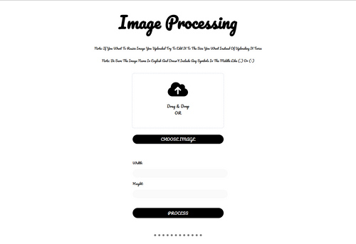
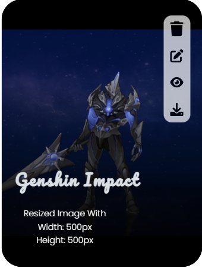

# Image Processing Api

## Welcome! 👋

**Thanks for checking out my project ❤**

**image processing api to resize images with extensions [.png, .jpeg, .jpg]**

**Notes**

- **If you want to resize image you uploaded try to edit it to the size you want instead of uploading it
  again**
- **be sure the image name in English and doesn't include any symbols in the middle like (.) or (-)**

### Table of contents

- [Overview](#overview)
    - [The Project](#The-Project)
    - [Screenshot](#Screenshot)

- [My Process](#my-process)
    - [Built with](#built-with)
    - [Scripts to run](#scripts-to-run)
    - [Endpoints](#endpoints)
    - [Functionalities](#Functionalities)
    - [Dependencies](#dependencies)
- [Author](#author)

## Overview

### The Project

Users should be able to:

- Be able to **Drag** and **Drop** the image to the special area for it
- Be able to **Choose** the image with Process Button
- Be able to **Resize** image to the desirable width and height
- Be able to **View all** images that got resized
- Be able to **Edit** the image that got resized to resize it again or change to another image
- Be able to **Download** the resized image
- Be able to **View** the image in the browser
- Be able to **Delete** the image
- **View the optimal layout** for the site depending on their device's screen size

### Screenshot



## My Process

### Built with

- **HTML**
- **SCSS**
- **JavaScript**
- **TypeScript**
- **Express**
- **Node**

### Scripts to run

- To run _nodemon_

```
  npm run start
```

- To build _TypeScript_

```
  npm run build
```

- To test with _jasmine_

```
  npm run jasmine
```

- To run tsc to build _TypeScript_ and test it with _jasmine_

```
  npm run test 
```

### Endpoints

_Note: index act as id_

1. /images for the **Main** page and show all images
2. /images/edit/:index To **Edit** an image with special
3. /images/download/:index To **Download** a resized image
4. /images/view/:index To **View** the resized image
5. /images/delete/:index To **Delete** the image

### Functionalities

After Hovering on the image that got resized



_note: image name will show 15 letters only_

- You will be able to see 4 Icons with image name
- Delete icon will Delete Both Original Image and resized image
- Edit icon will Edit the size depend on the original image not the resized one
    - You Can Change the previous image and replace it with new one
- View icon to show the icon on the browser
- Download icon to download the resized image

### Dependencies

- [EJS](https://www.npmjs.com/package/ejs)
- [Express](https://www.npmjs.com/package/express)
- [Method Override](https://www.npmjs.com/package/method-override)
- [Sharp](https://www.npmjs.com/package/sharp)
- [Uuid](https://www.npmjs.com/package/uuid)
- [Multer](https://www.npmjs.com/package/multer)
- [Jasmine](https://www.npmjs.com/package/jasmine)
- [Jasmine Spec Reporter](https://www.npmjs.com/package/jasmine-spec-reporter)
- [supertest](https://www.npmjs.com/package/supertest)

## Author

- GitHub - [Ali Ahmed](https://github.com/Dany-GitHub)